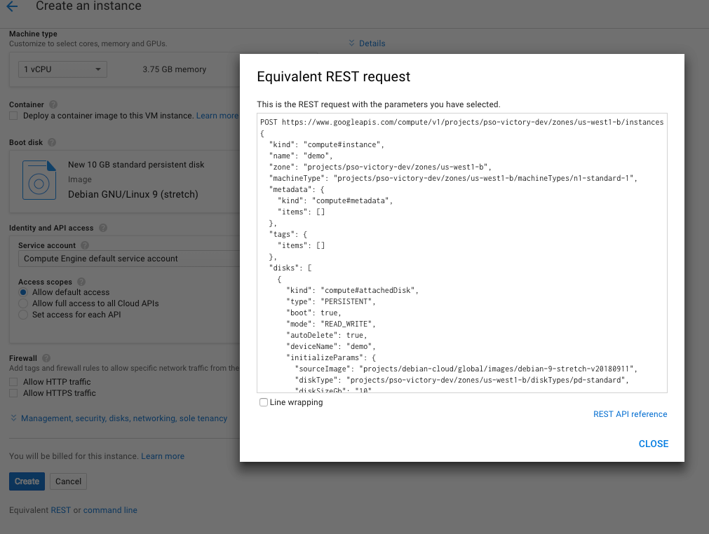

# Overview
I have found it is interesting and rewarding to learn the GCP REST APIs by directly interacting with 
them. 

## Review on client options 
* Google Cloud SDK a.k.a `gcloud`,`gsutil` etc. 
* [Google Cloud Client Libraries](https://cloud.google.com/apis/docs/cloud-client-libraries)
* Write your own:
  - REST
  - gRPC

## Prerequisites

In order to use the code in this demo you will need access to the following tools:

* A bash, or bash-compatible, shell
* Access to an existing Google Cloud project with the relevant service enabled
* If you do not have a Google Cloud Platform account you can sign up [here](https://cloud.google.com) and get 300 dollars of free credit on your new account.
* [Google Cloud SDK (200.0.0 or later)](https://cloud.google.com/sdk/downloads)

## Set up gcloud

### Authenticate gcloud

Prior to running this demo, ensure you have authenticated your gcloud client by running the following command:

```console
gcloud auth application-default login
```

### Configure gcloud settings

Run `gcloud config list` and make sure that `compute/zone`, `compute/region` and `core/project` are populated with values that work for you. For example, you can set their values with the following commands:

```console
# Where the region is us-west1
gcloud config set compute/region us-west1

Updated property [compute/region].
```

```console
# Where the zone inside the region is us-west1-b
gcloud config set compute/zone us-west1-b

Updated property [compute/zone].
```

```console
# Where the project id is my-project-id
gcloud config set project my-project-id

Updated property [core/project].
```

### Enable services

This project requires the following Google Cloud Service APIs to be enabled:

```
gcloud services enable compute.googleapis.com container.googleapis.com 
```

## Enable gcloud logging
*gcloud* with `log-http` option can log all HTTP server requests and responses to stderr. 

For example, lets say to list the regions
```
gcloud compute regions list --log-http 2>&1 >/dev/null  | less
```
reveals what `gcloud` does over the REST layer.

## Web console
In the web console, there is *equivalent REST or command line* can be used to discover 
how REST request  looks like, e.g. creating instances. This is what we would use for 
tools such as curl to construct such a type of request.


## Missing piece? 
How to authorize requests via an OAuth token. 
```
project_id=$(gcloud config get-value core/project)
TOKEN=$(gcloud config config-helper --format='value(credential.access_token)')
curl -s -X GET \
-H "Content-Type: application/json"  \
-H "Authorization: Bearer $TOKEN" https://www.googleapis.com/compute/v1/projects/${project_id}/regions
```

## Ready to curl the API?
```
./compute/list_regions.sh | jq -C . | less -R
```

## References
* [Gcloud Reference](https://cloud.google.com/sdk/gcloud/reference/)
* [Compute Engine Rest API](https://cloud.google.com/compute/docs/reference/rest/v1/)
* [Kubernetes Engine Rest API](https://cloud.google.com/kubernetes-engine/docs/reference/rest/)
* [Google Cloud Client Libraries](https://cloud.google.com/apis/docs/client-libraries-explained)
* [Google Cloud Client Library for Python](https://googleapis.github.io/google-cloud-python/latest/index.html)
* [cloud.google.com/go](https://godoc.org/cloud.google.com/go)